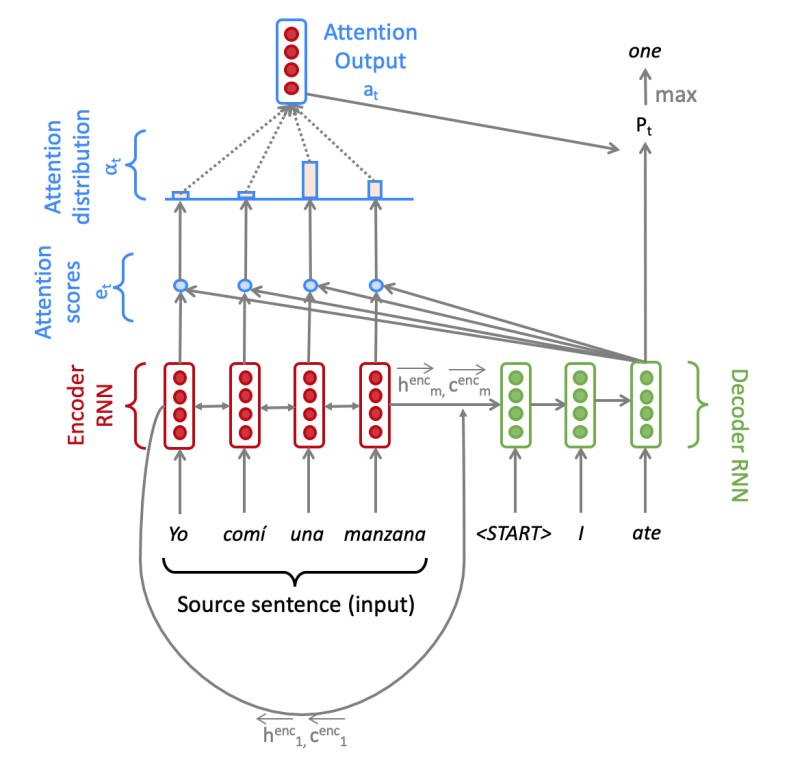

# CS224n Assignment 4: Neural Machine Translation with RNNs

This repository contains the implementation of a Neural Machine Translation (NMT) system based on Assignment 4 of the CS224n: Natural Language Processing with Deep Learning course. The goal of this project is to convert a sentence from a source language (e.g., Spanish) to a target language (e.g., English) using a sequence-to-sequence (Seq2Seq) network with attention.

## Model Overview

The NMT system consists of a Bidirectional LSTM Encoder and a Unidirectional LSTM Decoder. The Encoder processes the input sentence and generates hidden states and cell states for each token. The Decoder then generates the output sentence token by token, using the Encoder's hidden states and cell states along with an attention mechanism to focus on relevant parts of the input sentence.

## Requirements

- Python 3.6 or higher
- PyTorch 1.0 or higher
- NumPy

## Acknowledgements

This project is based on Assignment 4 of the CS224n: Natural Language Processing with Deep Learning course offered by Stanford University. The original assignment materials can be found [here](https://web.stanford.edu/class/archive/cs/cs224n/cs224n.1204/).
